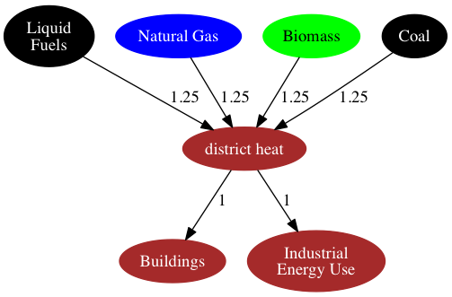

Heat is included as a final energy carrier in the IEA Energy Balances, and is intended to represent heat sold to third parties. That is, the use of heat and/or steam produced on-site from energy is simply reported as energy consumption.

Heat is not explicitly represented as an energy commodity in most regions in GCAM; instead, the reported fuel inputs to heat plants are assigned directly to the end use sectors that consume the heat (buildings and industry). Combined heat and power (CHP) is included as a technology option, but is located within the industrial energy use sector, and no inter-sectoral flow of heat is represented. However, in several regions where purchased heat accounts for a large share of the final energy use, GCAM does include a representation of district heat production, with four competing technology options, shown in Figure 1.

 
Figure 1: District heating structure, with example input-output coefficients shown.  
{: .fig}

As shown in Figure 1, all energy losses and cost mark-ups incurred in transforming primary energy into delivered district heat are accounted in the "district heat" technologies; there are no explicit cost adders and efficiency losses for heat distribution, or different prices for the heat consumed by buildings and industry sectors. This simplistic representation reflects the lack of data on district heating globally, and that the delineation of what constitutes a "third party sale" as opposed to on-site use is often unclear. This is illustrated further in Figure 2.

 
Figure 2: Energy flows in the pulp and paper industries, illustrating the delineation between energy producers and energy consumers. These components may or may not be located on the same property, or owned by the same entity, and the physical flows themselves often include backflows of combustible wastes from the "consumers" to the "producers". This complicates the accounting of what constitutes a "third party" sale of heat. Source: [IEA (2007)](en_refs.html#iea2007)
{: .fig}

Another accounting issue that pertains to district heating is that the regions where it is represented also tend to have a large share, up to 100% in some years, of their district heat produced at "main activity CHP plants", which are modeled in the electricity sector in GCAM (see  [IEA Mapping](en_IEA_mapping.html)). These are combined heat and power facilities whose primary purpose is sale of heat and/or electricity to third parties. In regions where heat is modeled as an energy commodity, the heat output of these main activity CHP plants is treated as a secondary output, and added to the total district heat produced in the given region. In future years, any new installations in the power sector are not assigned this secondary output of district heat; over time, these two sectors are modeled separately.