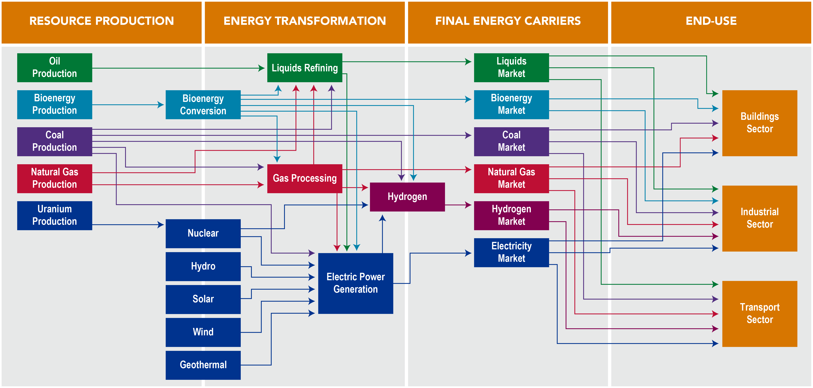

## Overview

GCAM structure are user defined, based on the data inputs provided to the model. This page describes the overall structure of the energy system as constructed in the current release version of GCAM. 

The overall structure of the energy system can be thought of as consisting of three main elements: energy resources, energy transformation, and final energy demands. It also tracks international trade in energy commodities. Consistent with the overall structure of GCAM, all the different elements of GCAM interact through market prices and physical flows of, for example, electricity. Technology choices are made based on prices using discrete [choice methods](choice.html).

  
Schematic of Major Energy Pathways in GCAM
{: .fig}

## Resources

### Depletable Resources 

* Oil and unconventional oil

* Natural gas

* Coal

* Uranium

*Under Construction*

### Renewable Resources 

* Wind

* Solar

* Geothermal

* Hydro

* Biomass (MSW)

*Under Construction*

## Energy Transformation

### Electricity

*Under Construction*

### Refining 

*Under Construction*

### Gas processing

*Under Construction*

### District Services

*Under Construction*

### Hydrogen

*Under Construction*

## Final Energy Consumption

### Buildings

* Structure and functional forms

*Under Construction*

### Industry

* Cement

* Fertilizer

* Other

*Under Construction*

### Transportation

* Structure and functional forms

*Under Construction*

## Energy Trade

*Under Construction*

## Mapping the IEA Energy Balances

*Under Construction*
