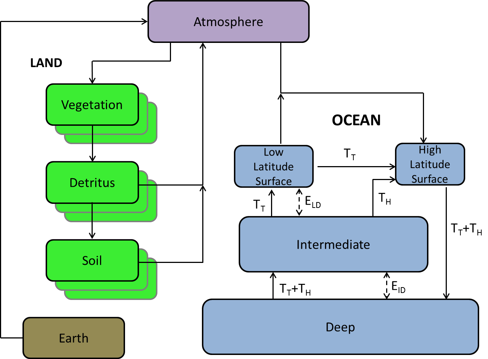

This section describes the new climate module - Hector - that is available for use in GCAM. In GCAM, in addition to running MAGICC 5.3 (Wigley, 2008), there is the option to run Hector (Hartin et al., 2015).  Both Hector and MAGICC are reduced-form climate carbon-cycle models. 

Hector, an open-source, object-oriented, reduced-form global climate carbon-cycle model, written in C++. This model runs essentially instantaneously while still representing the most critical global-scale earth system processes. Hector has a three-part main carbon cycle: a one-pool atmosphere, land, and ocean. The model’s terrestrial carbon cycle includes primary production and respiration fluxes, accommodating arbitrary geographic divisions into, e.g., ecological biomes or political units. Hector actively solves the inorganic carbon system in the surface ocean, directly calculating air– sea fluxes of carbon and ocean pH. Hector reproduces the global historical trends of atmospheric [CO2], radiative forcing, and surface temperatures. The model simulates all four Representative Concentration Pathways (RCPs) with equivalent rates of change of key variables over time compared to current observations, MAGICC (a well-known simple climate model), and models from the 5th Coupled Model Intercomparison Project. Hector’s flexibility, open-source nature, and modular design will facilitate a broad range of research in various areas. 

 
Figure 1: Representation of Hector’s carbon cycle, land, atmosphere, and ocean. The atmosphere consists of one well-mixed box. The ocean consists of four boxes, with advection and water mass exchange simulating thermohaline circulation. At steady state, the high-latitude surface ocean takes up carbon from the atmosphere, while the low-latitude surface ocean off-gases carbon to the atmosphere. The land consists of a user-defined number of biomes or regions for vegetation, detritus and soil. At steady state the vegetation takes up carbon from the atmosphere while the detritus and soil release carbon back into the atmosphere. The earth pool is continually debited with each time step to act as a mass balance check on the carbon system. 

For more information on Hector please see: 
[Hector - github repository](http://github.com/JGCRI/Hector)
Hartin et al. 2015 – Geoscientific Model Development
Hartin et al. 2016 – Biogeosciences

##GCAM-Hector interactions
Currently the GCAM sectors interact with Hector via their emissions.  At every time step, emissions from GCAM are passed to Hector. Hector takes in emissions, converts to concentrations where necessary, and calculates the radiative forcing, as well as the resulting climate variables (e.g., temperature, carbon-fluxes, etc.)  

| Emission| Sector  | Notes |
| ------- |:-------:| :------: |
| CO2     | AgLU, Energy  | |
| CH4     | AgLU    | |
| N2O 	  | AgLU    | |
| NH4     | AgLU    | not included in Hector |
| SO2    | AgLU    | |
| CO 	  | AgLU    |         |
| BC      | AgLU, Energy    | |
| OC      | AgLU, Energy    ||
| NOx 	  | AgLU    | |
Table 1: Emissions and sources from each sector passed to Hector. 

##Hector Outputs
At every time step Hector calculates and outputs key climate variables.  
#####Atmosphere
Global mean temperature change
Radiative forcing of all emissions
Atmospheric CO2 concentrations
#####Land
Air-land carbon fluxes
NPP - net primary production
RH - heterotrophic respiration
Carbon pools (vegetation, detritus, soil)	
#####Ocean
Air-sea carbon fluxes
Carbon pools (high and low latitude surface, intermediate and deep)
Carbonate system (DIC, pCO2 , CO32-, pH, aragonite and calcite saturations)
surface ocean temperature
oceanic heat flux

##Building Hector + GCAM
For instructions on how to build GCAM with Hector click [here](https://confluence.pnnl.gov/confluence/pages/viewpage.action?pageId=63278699)

##References
1. Hartin, C. A., Patel, P., Schwarber, A., Link, R. P., and Bond-Lamberty, B. P.: A simple object-oriented and open-source model for scientific and policy analyses of the global climate system – Hector v1.0, Geosci. Model Dev., 8, 939-955, doi:10.5194/gmd-8-939-2015, 2015. 
2. Hartin, C. A., Bond-Lamberty, B., Patel, P., and Mundra, A.: Ocean acidification over the next three centuries using a simple global climate carbon-cycle model: projections and sensitivities, Biogeosciences, 13, 4329-4342, doi:10.5194/bg-13-4329-2016, 2016. 
3. Wigley, T. M. (2008), MAGICC/SENGEN 5.3: User manual (version 2), edited, p. 80, NCAR, Boulder CO.

