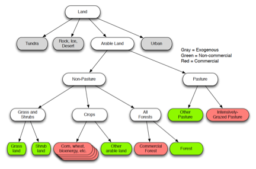

{:toc}

## Description

### Economic Modeling Approach

In this section, we describe and discuss the approach we have developed for the economic modeling of land allocation in the Global Change Analysis Model (GCAM). More information, including a comparison to other models, is available in Wise et al. (2014).

#### Land Sharing Approach 

Economic land use decisions in GCAM are based on a logit model of sharing based on relative inherent profitability of using land for competing purposes. In GCAM, there is a distribution of profit behind each competing land use within a region. The share of land allocated to any given use is based on the probability that that use has a highest profit among the competing uses. For more information, see the detailed description of the [land sharing approach](details_land.html#landsharingapproach).

### Land Nesting Strategy

The way land types are nested in GCAM, in combination with the logit exponents used, determines the substitutability of different land types in the model in future periods. Figure 1 shows the nesting diagram of land with a subregion. Note that crops are further divided beyond what is in Figure 1, nesting irrigated/rainfed and hi/lo fertilizer. For more information, see the detailed description of the [land nesting strategy](details_land.html#landnestingstrategy).

 
Figure 1: AgLU Land Nest
{: .fig}

### Intensification

The inclusion of multiple management types for each crop within each subregion of GCAM allows the model to represent price-induced intensification. That is, we can increase yields via increased fertilizer or irrigation if economic conditions favor those options. Like the rest of the land allocation decisions in GCAM, the share of each management practice depends on relative profitability. As profits of one option increase, more land will be allocated to that option. If the option is higher yielding, then average yields will increase (an intensification response). In general, GCAM will intensify when there is a lot of land competition (like when carbon in land is valued). Note that it is possible for average yields in a subregion to decline over time; this will happen if commodity prices decline or if the price of fertilizer and/or water increases. 

### Land Regions

For GCAM3.0 through GCAM4.4, the Agriculture and Land Use model subdivided the GCAM geopolitical regions into as many as 18 climatically defined agro-ecological zones (AEZs) developed by the GTAP group. GCAM5+ switches subregions to water basin-defined geographic land units (GLUs). The land data system files are produced by the [Moirai](https://github.com/JGCRI/moirai), described in Di Vittorio et al. (2016). 

## Calibration

While the profit-based logit land sharing is fairly straightforward, it must be calibrated to match historical data on land use shares and profit rates in the base year. The calibration method solves for parameters that adjust observed profit rates, which are based on base year data, such that they equal the potential average profit rates implied by base year shares and the assumed average price of unmanaged land. In future model periods, the calibration profit scalers calculated in the final historical period are used to adjust the future profit rates in the logit sharing and profit equations. For more information, see the detailed description of the [calibration](details_land.html#calibration). Additional information is also provided on [modeling new land uses or crops](details_land.html#modelinglandusesandcropsthatarenewtoaregion) and [crop outliers](details_land.html$#cropoutliers)

### Regional Production and Comparative Advantage
In its determination of the economic allocation of crop production and land use across regions of the globe, GCAM follows the basic economic principle of comparative advantage. In simplest terms, countries or regions will produce more of what they are better at and import more of what they are not as good at producing.  For more information, see the detailed description of [comparative advantage](details_land.html#regionalproductionandcomparativeadvantage).

## Terrestrial Carbon Approach

Land-use change CO2 emissions are calculated in GCAM using a simple accounting approach, similar to that of Houghton (1999). That is, GCAM determines the change in above and below ground carbon stock for a given land use change and allocates that change in carbon stock over time.  

### Vegetation Carbon

For vegetation carbon, we distinguish between two different activities – land expansion and land contraction. In the event that land contracts, i.e., there is less land in the current period than the previous period, we assume that all emissions are released instantaneously.  In this event, the land-use change emissions for the current period from above ground carbon changes are equal to the change in above ground carbon stock. Emissions from above ground carbon changes for all other periods are equal to zero. In the event land expands, we spread the change in carbon stock across time depending on the length of time it takes for the vegetation to mature.  For crops, the mature age is typically set a 1 year, meaning that all carbon uptake occurs instantaneously. For forests, however, we assume it takes anywhere from 30 years to 100 years to uptake all of the carbon. We use an example of the Bertalanffy-Richards function.

### Soil Carbon

For soil carbon, we assume we assume both emissions and uptake are exponential, where the exponential half-life depends on the region. Colder regions have longer half-lives.

### Carbon Stocks

GCAM tracks carbon stocks by calculating and storing cumulative land-use change emissions, and then applying those emissions as time proceeds. As land expands, we compute future uptake to be added to the carbon stock, and as land contracts we compute future emissions to subtract from the carbon stock.

## Equations 
QUESTION: Should this be a child page?

## Insights and intuition
TODO: Include references to key papers

## Modifying the model
QUESTION: here or in separate page/child page?

## Policy options 
QUESTION: here or in modifying model?

